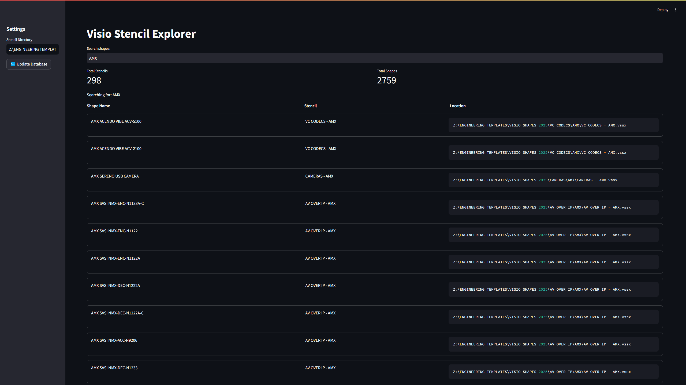

# 🔍 Visio Stencil Search

<div align="center">


**A lightweight application to catalog and search Visio stencil files across your network.**

[Key Features](#key-features) • [Installation](#installation) • [Usage](#usage) • [Documentation](#documentation)

</div>

---

## 📋 Overview

This tool helps engineers quickly find which stencils contain specific shapes and their physical storage locations, without requiring Visio installation to operate. It also includes a utility for finding and removing problematic Visio temporary files.



## ✨ Key Features

- 📁 **Network Directory Scanning** - Recursively finds Visio files (.vss, .vssx, .vssm)
- 🔎 **Real-time Shape Search** - Instantly search across thousands of shapes
- 🔄 **Zero Visio Dependencies** - Works without Visio installation
- 📊 **Clear Results Display** - Shows shape name, stencil name, and file path
- 👁️ **Accurate Shape Previews** - Visualize shapes with actual geometry data
- 🏷️ **Shape Metadata Filtering** - Filter shapes by dimensions and properties
- 🔗 **Enhanced Visio Integration** - Improved error handling and cross-platform support
- ⚙️ **User Customization** - Configure default startup directory and search mode
- 🧹 **Temp File Cleaner** - Find and remove corrupted Visio temporary files that cause errors
- 🧪 **Advanced Stencil Health Monitor** - Analyze stencils for issues with data visualization
  - Identify empty stencils
  - Detect duplicate shapes
  - Find multiple versions of the same stencil
  - Flag unusually large stencils
  - Identify potentially corrupt files

## 💻 Installation

### Prerequisites

- Python 3.8 or higher
- Git (optional, for cloning)

### Quick Install

```bash
# Clone the repository
git clone https://github.com/Saml1211/streamlit-stencil-search.git

# Navigate to project directory
cd streamlit-stencil-search

# Install dependencies
pip install -r requirements.txt
```

<details>
<summary><b>📥 Detailed Installation Instructions</b></summary>

### Step 1: Download the application

**Option A: Download as ZIP (Recommended for beginners)**
1. Download this repository as a ZIP file from [github.com/Saml1211/streamlit-stencil-search](https://github.com/Saml1211/streamlit-stencil-search)
2. Extract the ZIP file to a location on your computer
3. The extracted folder should be named "streamlit-stencil-search"

**Option B: Clone using Git (For users familiar with Git)**
1. If you don't have Git installed, download and install it from [git-scm.com](https://git-scm.com/downloads)
2. Open Command Prompt (Windows) or Terminal (Mac/Linux)
3. Navigate to the directory where you want to install the application
4. Run the following command:
   ```
   git clone https://github.com/Saml1211/streamlit-stencil-search.git
   ```

### Step 2: Install required packages

1. Open Command Prompt (Windows) or Terminal (Mac/Linux)
2. Navigate to the extracted folder:
   ```
   cd path\to\streamlit-stencil-search
   ```
   Example: `cd C:\Users\YourName\Documents\streamlit-stencil-search`

3. Install the required Python packages:
   ```
   pip install -r requirements.txt
   ```
   This may take a few minutes to complete.
</details>

## 🚀 Usage

### Starting the Application

```bash
streamlit run app.py
```

The application will open in your default web browser at `http://localhost:8501`

### Search for Shapes

1. Set the stencil directory path in the sidebar
2. Click "🔄 Update Database" to scan for stencils
3. Enter a search term in the search box
4. Browse results showing shapes, their parent stencils, and file locations
5. Click the "👁️ Preview" button to see a visual representation of any shape

### Clean Temporary Files

1. Navigate to the "Temp File Cleaner" page using the sidebar
2. Enter the directory to scan (e.g., network shares or local folders)
3. Click "Scan for Temp Files"
4. Review the list of found temporary files
5. Select files to delete and click the delete button

### Analyze Stencil Health

1. Navigate to the "Stencil Health" page using the sidebar
2. Enter the stencil directory path
3. Click "Analyze Health" to scan for issues
4. Review the visualized health data and issue details
5. Filter issues by severity and type
6. Export reports in CSV or Excel format

<details>
<summary><b>🌐 Sharing with Others on Your Network</b></summary>

To make the application accessible to others on your local network:

1. Run the application with:
   ```bash
   streamlit run app.py --server.address=0.0.0.0
   ```

2. Find your computer's IP address:
   - Windows: Run `ipconfig` in Command Prompt
   - Mac: Run `ifconfig` in Terminal
   - Look for "IPv4 Address" or "inet" (usually starts with 192.168.x.x or 10.0.x.x)

3. Share this URL with others:
   ```
   http://YOUR-IP-ADDRESS:8501
   ```

4. Requirements:
   - Your computer must remain on and running the application
   - Your firewall must allow connections on port 8501
</details>

## 🛠️ Troubleshooting

| Issue | Solution |
|-------|----------|
| **Python not recognized** | Ensure Python is properly installed and added to your PATH |
| **ModuleNotFoundError** | Try reinstalling with `pip install -r requirements.txt` |
| **Port already in use** | If port 8501 is in use, Streamlit will try the next port |
| **Scan not finding files** | Verify path exists and contains Visio files (.vss, .vssx, .vssm) |

## 📁 Project Structure

```
streamlit-stencil-search/
├── app/                  # Core application logic
│   └── core/             # Business logic (parsing, scanning, etc.)
│       ├── db.py                # Database operations and search functionality
│       ├── file_scanner.py      # File scanning and discovery
│       ├── logging_utils.py     # Logging utilities for debugging
│       ├── shape_preview.py     # Shape preview generation with geometry data
│       ├── stencil_parser.py    # Stencil parsing with metadata extraction
│       └── visio_integration.py # Visio COM API integration
├── pages/                # Streamlit pages
│   ├── 01_Visio_Stencil_Explorer.py # Main search interface
│   ├── 02_Temp_File_Cleaner.py      # Temp file cleaner tool
│   └── 03_Stencil_Health.py         # Stencil health analysis tool
├── data/                 # Cached stencil data (database)
├── logs/                 # Application logs for debugging
├── docs/                 # Documentation and images
├── app.py                # Main application entry point (using st.navigation)
├── config.yaml           # Application configuration and user preferences
└── requirements.txt      # Python dependencies
```

## 📚 Documentation

For detailed project information, status, and roadmap, see the [Project Documentation](docs/project_status.md).

---

<div align="center">

  Made with ❤️ by Sam Lyndon

  © 2025
</div>